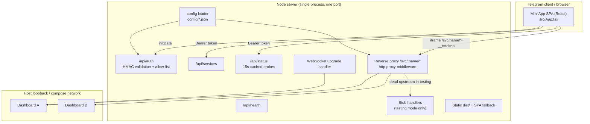
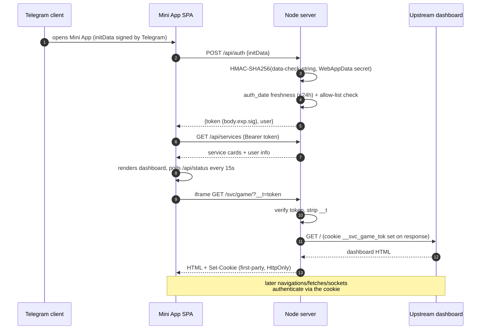
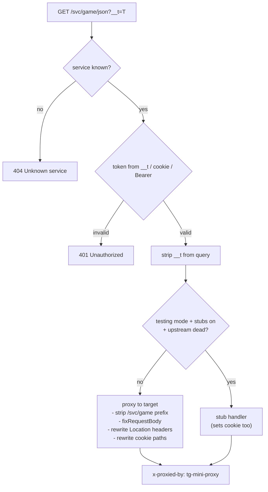
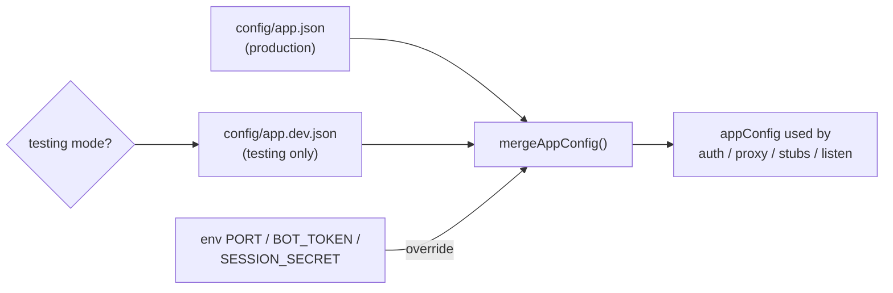

# Architecture

## Component overview



## Authentication flow



### Session tokens

- Format: `body.expiry.signature` — HMAC-SHA256 signed, timing-safe compare.
- The user id lives **in the server-side session store**, not in the token.
- Store is in-memory: restart logs everyone out; move to Redis for replicas.

### initData validation (server/telegram.ts)

Exactly Telegram's documented scheme:

1. `data-check-string` = sorted `key=value` lines of initData minus `hash`.
2. `secret = HMAC-SHA256(key="WebAppData", msg=botToken)`.
3. Valid iff `HMAC-SHA256(key=secret, msg=data-check-string) == hash`
   (timing-safe compare) **and** `auth_date` is within 24h.

## Reverse proxy details



- **Cookie exchange:** the first iframe load authenticates via `?__t=`; the
  server removes it before the upstream sees it and sets
  `__svc_<name>_tok` as a first-party, `HttpOnly`, `SameSite=Lax` cookie
  scoped to `/svc/<name>/`. Each service gets its own cookie so several
  dashboards can be open at once.
- **Redirects:** upstream `Location: /json` becomes `/svc/game/json`
  (same-host redirects only; absolute external redirects pass through).
- **WebSockets:** the HTTP `upgrade` event is intercepted for `/svc/:name/*`,
  token-verified, prefix-stripped and proxied with `ws: true`.
- **Status probes:** `/api/status` pings each upstream root with a 1.5s
  timeout, TTL-cached 15s; in testing mode with stubs a dead upstream reports
  `stub` instead of `offline`.

## Configuration loading



Testing mode = `NODE_ENV === "development"` or `TG_MINIAPP_MODE === "preview"`.
The Dockerfile sets `NODE_ENV=production`, so a container never accidentally
loads dev config; the dev compose explicitly sets `TG_MINIAPP_MODE=preview`.

## Stub subsystem (testing only)

- `server/stubs.ts` exports an **in-process handler** — it shares the main
  HTTP port and opens no extra listeners (kept deliberate: extra ports break
  container/preview readiness probes).
- A lazy reachability probe (400ms timeout, cached for the process lifetime)
  routes requests to the stub only while the real upstream is down. Start the
  real dashboard and restart the server — or just accept that stubs win after
  a fresh boot until the first probe.

## Repository layout

```
├── server/            # Express + proxy + auth + config + stubs + status
├── src/               # Mini App SPA (React, Telegram theme vars)
├── config/            # ALL runtime configuration (mounted into containers)
├── docs/              # this documentation site (docsify, GitHub Pages)
├── scripts/           # check.mjs (one-command verify), badges.mjs
├── tests/             # vitest unit + end-to-end smoke tests
├── stub/              # static pages for the compose dev stub containers
├── Caddyfile          # TLS terminator config (env-templated)
├── docker-compose.yml # production: Caddy + proxy
└── docker-compose.dev.yml # dev: proxy + stub containers, config mounted
```
