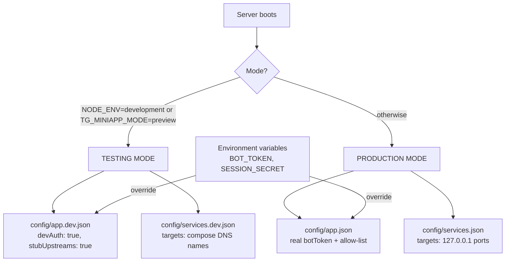

# Configuration

All application configuration lives in **JSON files under `config/`** — not in
environment variables. The directory is mounted into the container, so you can
edit configuration on the server host and apply it with a container restart
(`docker compose up -d`) **without rebuilding the image**.

## File layout

```
config/
├── app.example.json    # PRODUCTION TEMPLATE — copy to app.json and fill in
├── app.json            # production app config (git-ignored, holds secrets)
├── app.dev.json        # TESTING config — used as-is, contains no secrets
├── services.json       # production services → http://127.0.0.1:<port>
└── services.dev.json   # compose dev services → compose DNS names
```

## Which files are used when

The server picks its configuration by **mode**, not by hostname:



| | Testing mode | Production mode |
|---|---|---|
| Trigger | `NODE_ENV=development` or `TG_MINIAPP_MODE=preview` | neither set (the Dockerfile sets `NODE_ENV=production`) |
| App config | `config/app.dev.json` | `config/app.json` |
| Services | `config/services.dev.json` | `config/services.json` |
| Browser logins | `?devUserId=<n>` | refused (`403 dev_auth_disabled`) |
| Dead upstreams | built-in stub page | `502` from the proxy |
| Secrets allowed | none — commit as-is | yes — `app.json` is git-ignored |

## App config reference (`app.json` / `app.dev.json`)

```jsonc
{
  // Telegram bot token from @BotFather. Required in production (initData
  // validation). In testing mode it is not needed.
  "botToken": "7000000000:AA...",

  // Telegram user ids allowed to use the app. ["*"] = any user whose
  // initData validates. Production should list real ids:
  "allowedUserIds": ["123456789", "987654321"],

  // Secret for signing session tokens. Falls back to botToken if empty.
  // Generate one: node -e "console.log(require('crypto').randomBytes(32).toString('base64url'))"
  "sessionSecret": "",

  // Session lifetime in seconds (default 12h).
  "sessionTtlSeconds": 43200,

  // TESTING ONLY: accept ?devUserId=<n> logins. Must be false in production.
  "devAuth": false,

  // TESTING ONLY: serve a built-in stub page when an upstream is down, so
  // the whole flow can be demoed without real dashboards.
  "stubUpstreams": false,

  // Port to listen on. The PORT environment variable (set by the platform
  // or compose) wins over this.
  "port": 3000
}
```

## Services config reference (`services.json`)

```jsonc
{
  "services": [
    {
      "id": "game",                          // unique id (used in tests/tools)
      "title": "Game Dashboard",             // card label
      "emoji": "🎮",                         // card icon
      "description": "My game admin panel",  // optional card subtitle
      "target": "http://127.0.0.1:15080",    // upstream base URL
      "path": "game"                         // → /svc/game/*
    }
  ]
}
```

Rules:

- `path` values must be unique; duplicates are dropped at load time.
- `target` hosts: use `127.0.0.1`/`localhost` for services on the same host,
  or compose service names (`http://stub-game:80`) inside a compose network.
- Upstreams should bind to loopback only — the proxy is their public doorway.

## Configuration cases by environment

### A. Local browser testing (no Docker, no bot)

`config/app.dev.json` ships ready to use (`devAuth`, `stubUpstreams` on).
The only command chain:

```bash
bun install && bun run build
TG_MINIAPP_MODE=preview bun run start
bun run check        # everything green without any real upstream
```

### B. Local compose testing (stub containers)

`docker-compose.dev.yml` mounts `config/` and sets `TG_MINIAPP_MODE=preview`.
Stubs (nginx, python http.server) live on the internal compose network, so
`config/services.dev.json` targets `http://stub-game:80` etc.:

```bash
docker compose -f docker-compose.dev.yml up --build
bun run check http://localhost:3000
```

To point the dev stack at a *real* dashboard instead of a stub, change its
`target` in `config/services.dev.json` (e.g. to `http://host.docker.internal:15080`
on Docker Desktop) and `docker compose -f docker-compose.dev.yml up -d`.

### C. Production on your server (real Telegram)

```bash
git pull
cp config/app.example.json config/app.json
nano config/app.json          # botToken + allowedUserIds (real ids!) + sessionSecret
nano config/services.json     # your real dashboards on 127.0.0.1
nano .env                     # DOMAIN, ACME_EMAIL, HTTPS_PORT, HTTP_PORT
docker compose up -d --build  # Caddy gets certificates automatically
bun run check https://your.domain
```

Then register the Mini App with @BotFather → Bot Settings → Menu Button →
`https://your.domain`.

### D. Freebuff/managed preview (this workspace)

The platform runs the preview in testing mode automatically (`TG_MINIAPP_MODE`
is injected via the sandbox `.env.local`). No config changes needed — open the
preview with `?devUserId=42`. Production deploys from the Deploy button are a
separate environment and never see sandbox variables.

## Updating without rebuilds

Because `config/` is a bind mount, the update loop is:

```bash
git pull                      # new code + new config templates
nano config/app.json          # optional: adjust settings
docker compose up -d          # recreates containers with the same image
```

The image only needs a rebuild when `package.json`, `server/` or the frontend
change — in that case `docker compose up -d --build`.

## Precedence summary

1. Environment variables (`PORT`, `BOT_TOKEN`, `SESSION_SECRET`) — highest
2. `config/app.dev.json` — testing mode only
3. `config/app.json` — production
4. Built-in defaults — lowest
