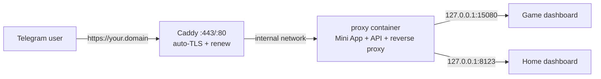

# Deployment

The production stack is two containers behind automatic HTTPS:



## One-time setup (Ubuntu server)

```bash
# 1. Get the code
git clone <your-repo> && cd <your-repo>

# 2. Compose settings (domain + TLS)
cp .env.compose.example .env    # or create .env manually, see below
nano .env

# 3. App configuration (secrets + services)
cp config/app.example.json config/app.json
nano config/app.json config/services.json

# 4. DNS: point your domain's A record at this server

# 5. Start
docker compose up -d --build
```

`.env` (compose-level only — app config lives in `config/`):

```ini
DOMAIN=panel.example.com      # DNS A record → this server
ACME_EMAIL=you@example.com    # Let's Encrypt registration email
HTTPS_PORT=443                # public HTTPS port; custom (e.g. 8443) is fine
HTTP_PORT=80                  # must stay reachable for ACME HTTP-01
```

Requirements for certificates:

- `DOMAIN` has a public DNS A/AAAA record pointing at the server.
- Port **80** is reachable from the internet (HTTP-01 challenge). Caddy
  issues on first start and **renews automatically** — no certbot, no cron;
  certs persist in the `caddy_data` volume.
- Custom HTTPS ports work because DNS records do not contain ports — users
  then visit `https://your.domain:8443`.

## Registering with Telegram

1. @BotFather → `/mybots` → your bot → **Bot Settings → Menu Button** →
   set the URL to `https://your.domain` (or with your custom port).
2. Alternatively attach an inline keyboard button of type `web_app`.
3. Telegram requires HTTPS — plain `http://` is rejected at registration.

## Updating

```bash
git pull
nano config/app.json config/services.json   # optional config changes
docker compose up -d                        # applies config, no rebuild
```

Rebuild only when code changes:

```bash
git pull && docker compose up -d --build
```

## Verifying

```bash
bun run check https://your.domain    # full user flow, exit code reflects health
curl -s https://your.domain/api/health
```

The dashboard itself shows each service as **online** (green, with latency),
**offline** (red) or **stub** (amber, testing mode only), polled every 15s.

## Running without Docker

Any machine with Node 20+:

```bash
bun install && bun run build
NODE_ENV=production bun run start    # reads config/app.json + config/services.json
```

Put Caddy/nginx (or any TLS terminator) in front, or use a tunnel
(cloudflared/ngrok) for quick trials.

## Hardening notes

- Keep upstream dashboards bound to `127.0.0.1` — the proxy is the only
  public doorway.
- Set a dedicated `sessionSecret` in `config/app.json`; it survives bot-token
  rotation.
- Sessions are in-memory; behind multiple replicas move them to Redis.
- `config/app.json` is git-ignored precisely because it holds the bot token.
