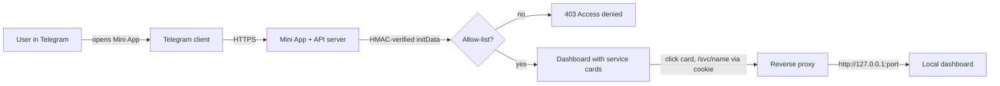

# Getting started

A Telegram Mini App that authenticates users via Telegram's signed `initData`
and proxies their browser to internal dashboards running on the same server
(`127.0.0.1:<port>` services that are otherwise unreachable from the internet).



## Prerequisites

- Node.js 20+ (or Bun 1.1+) — the runtime is plain Node; Bun is used for
  package management in CI
- A Telegram bot token from [@BotFather](https://t.me/BotFather)
- Your numeric Telegram user id (get it from [@userinfobot](https://t.me/userinfobot))

## 1. Install and run in testing mode

Testing mode needs **no bot token and no Telegram** — the server accepts
`?devUserId=<n>` logins and serves built-in stub pages for services whose
upstream isn't running:

```bash
bun install          # or: npm install
bun run build
TG_MINIAPP_MODE=preview bun run start
```

Open `http://localhost:3000/?devUserId=42` — you should see the dashboard
with both service cards showing an amber **stub** status.

## 2. Verify everything works (one command)

```bash
bun run check
```

This exercises the exact user flow — health → auth → service list → proxied
content with the cookie exchange — and exits non-zero on the first failure.
It works against any deployment: `bun run check https://your.host`.

## 3. Run the test suite

```bash
bun run test             # unit + end-to-end smoke tests
bun run test:coverage    # with a coverage report
```

The smoke test boots the real server on a random port and drives the same
flow as `bun run check`, so a green test run means the deployment path works.

## Next steps

- [Configuration](configuration.md) — fill in `config/app.json` for production
- [Deployment](deployment.md) — Docker Compose with automatic HTTPS
- [Architecture](architecture.md) — how the proxy, auth and stubs fit together
