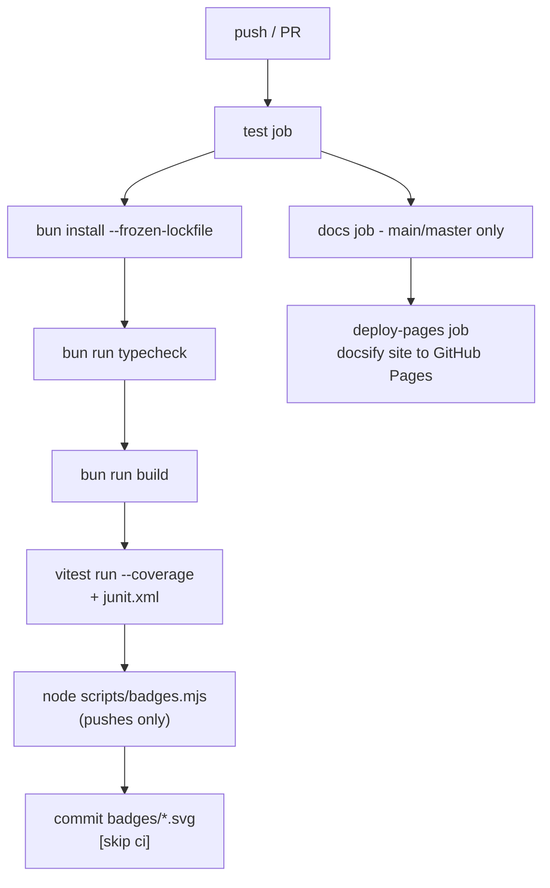

# Testing & CI

## Test suites

```bash
bun run test            # vitest run (unit + smoke)
bun run test:coverage   # + v8 coverage report (text, lcov, json-summary)
```

| Suite | What it covers |
|---|---|
| `tests/unit.test.ts` | initData HMAC validation (accept/tamper/wrong-token/stale/malformed), upstream status probing (online with latency, offline, TTL cache) |
| `tests/smoke.test.ts` | boots the **real server** in testing mode on a random port and drives the whole flow: health → dev auth → auth-gated service list → `/api/status` → proxied stub content with the `__t`→cookie exchange → forged-token rejection |

The smoke test is effectively a self-contained integration test of the exact
path production traffic takes — if it passes, `bun run check` against your
deployment should pass too.

## One-command deployment check

```bash
bun run check                    # http://localhost:3000
bun run check https://your.host  # any deployment
bun run check <url> <devUserId>
```

Checks, in order: `/api/health` → auth (testing-mode login **or** graceful
production refusal) → service list → per service: proxy status + `Set-Cookie`
+ redirect prefix → content via cookie with `x-proxied-by: tg-mini-proxy` and
a non-empty body. Exits non-zero on the first failure, so it is CI-usable.

## CI pipeline

`.github/workflows/ci.yml` runs on **ubuntu-latest** for pushes and PRs:



### Badges

`scripts/badges.mjs` renders static shields-style SVGs from the CI artifacts:

- `badges/tests.svg` — `tests N passing` (green) or failing count (red),
  parsed from `junit.xml`
- `badges/coverage.svg` — statements coverage % with a green→red scale,
  parsed from `coverage/coverage-summary.json`

Both are **committed back to the repo** by CI (via
`stefanzweifel/git-auto-commit-action`) so the README can reference them as
plain repo paths — no external badge service, works on private repos too.

The README shows them next to a link into this documentation site.

## GitHub Pages

The `docs/` directory is a [docsify](https://docsify.js.org) site: markdown
files rendered client-side, **no build step** — Pages serves the directory
verbatim (`.nojekyll` included). Mermaid diagrams render via the mermaid
plugin. Pages deploys from the `deploy-pages` job on `main`/`master` pushes
(enable **Settings → Pages → Build and deployment → Source: GitHub Actions**
once, if not already set).

## Adding tests

- Unit tests go in `tests/unit.test.ts` (or a sibling `*.test.ts`) and should
  not bind ports.
- Anything HTTP-level belongs in `tests/smoke.test.ts` style: spawn
  `server/index.ts` with `PORT=<random>` + `TG_MINIAPP_MODE=preview`, wait for
  `/api/health`, exercise, kill.
- Run the full suite locally before pushing; CI enforces the same via
  `bun run test:coverage`.
